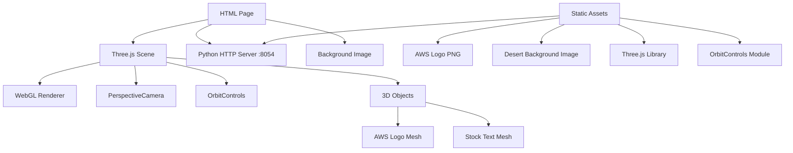

# Design Document

## Overview

The AWS Logo WebGL Application is a single-page web application that creates an immersive 3D experience featuring the AWS logo as a rotating textured object with real-time stock information display. The application leverages Three.js for WebGL rendering, OrbitControls for user interaction, and a custom desert background generated using AWS Nova Canvas. The solution follows KISS principles with a minimal, focused architecture.

## Architecture



### Core Components

1. **Web Server Layer**: Python's simple HTTP server serving static content on port 8054
2. **Rendering Layer**: Three.js WebGL renderer with scene management
3. **Interaction Layer**: OrbitControls for mouse-based camera manipulation
4. **Content Layer**: 3D meshes for logo and text display
5. **Background Layer**: Responsive desert background image

## Components and Interfaces

### HTML Structure
```html
<!DOCTYPE html>
<html>
<head>
    <title>AWS Logo 3D Viewer</title>
    <style>
        body { margin: 0; overflow: hidden; }
        #container { 
            width: 100vw; 
            height: 100vh; 
            background-image: url('desert-background.png');
            background-size: cover;
            background-position: center;
        }
    </style>
</head>
<body>
    <div id="container"></div>
    <script type="module" src="app.js"></script>
</body>
</html>
```

### JavaScript Application Structure
```javascript
// Core Three.js setup
const scene = new THREE.Scene();
const camera = new THREE.PerspectiveCamera(75, window.innerWidth / window.innerHeight, 0.1, 1000);
const renderer = new THREE.WebGLRenderer({ alpha: true });

// OrbitControls integration
const controls = new OrbitControls(camera, renderer.domElement);

// 3D Objects
const logoMesh = createLogoMesh();
const stockTextMesh = createStockTextMesh();
```

### Key Interfaces

#### Scene Management Interface
- **Scene Setup**: Initialize Three.js scene, camera, renderer
- **Asset Loading**: Load AWS logo texture and create materials
- **Object Creation**: Generate 3D meshes for logo and text
- **Animation Loop**: Continuous rendering and rotation updates

#### User Interaction Interface
- **Mouse Controls**: OrbitControls for camera manipulation
- **Responsive Design**: Window resize handling
- **Performance Optimization**: Efficient rendering loop

#### Content Display Interface
- **Logo Display**: Textured plane/geometry with AWS logo
- **Stock Information**: 3D text displaying AMZN stock value
- **Background Integration**: Desert scene with supernatural vegetation

## Data Models

### Scene Configuration
```javascript
const sceneConfig = {
    camera: {
        fov: 75,
        aspect: window.innerWidth / window.innerHeight,
        near: 0.1,
        far: 1000,
        position: { x: 0, y: 0, z: 5 }
    },
    renderer: {
        alpha: true,
        antialias: true,
        size: { width: window.innerWidth, height: window.innerHeight }
    },
    controls: {
        enableDamping: true,
        dampingFactor: 0.05,
        enableZoom: true,
        enablePan: true
    }
};
```

### Logo Object Model
```javascript
const logoObject = {
    geometry: new THREE.PlaneGeometry(2, 1),
    material: new THREE.MeshBasicMaterial({
        map: logoTexture,
        transparent: true
    }),
    rotation: { x: 0, y: 0, z: 0 },
    position: { x: 0, y: 0.5, z: 0 },
    rotationSpeed: 0.01
};
```

### Stock Display Model
```javascript
const stockDisplay = {
    text: "AMZN: $XXX.XX", // Will be updated with current value
    font: "Arial",
    size: 0.2,
    position: { x: 0, y: -0.5, z: 0 },
    color: 0xffffff,
    parent: logoObject // Rotates with logo
};
```

### Background Configuration
```javascript
const backgroundConfig = {
    imagePath: "desert-background.png",
    targetSize: { width: 1920, height: 1088 },
    cssProperties: {
        backgroundSize: "cover",
        backgroundPosition: "center",
        backgroundRepeat: "no-repeat"
    }
};
```

## Error Handling

### Asset Loading Errors
- **Texture Loading Failures**: Fallback to colored materials if logo texture fails to load
- **Font Loading Issues**: Use browser default fonts if custom fonts unavailable
- **Network Errors**: Display error messages for failed resource loading

### WebGL Compatibility
- **WebGL Support Detection**: Check for WebGL availability and display fallback message
- **Performance Degradation**: Monitor frame rates and adjust quality if needed
- **Memory Management**: Proper disposal of geometries and materials

### User Interaction Errors
- **Control Initialization**: Graceful fallback if OrbitControls fail to initialize
- **Resize Handling**: Robust window resize event management
- **Touch Device Support**: Ensure controls work on touch devices

## Testing Strategy

### Browser Testing
- **Chrome Latest Version**: Primary target browser for testing
- **WebGL Feature Testing**: Verify all WebGL features function correctly
- **Performance Testing**: Monitor frame rates and rendering performance
- **Responsive Testing**: Test various screen sizes and aspect ratios

### Functional Testing
- **3D Rendering**: Verify logo displays correctly as 3D textured object
- **Rotation Animation**: Confirm smooth, continuous rotation
- **Mouse Controls**: Test orbit, zoom, and pan functionality
- **Stock Display**: Validate stock value positioning and rotation synchronization
- **Background Display**: Ensure proper background scaling and positioning

### Integration Testing
- **Server Functionality**: Test Python HTTP server on port 8054
- **Asset Loading**: Verify all static assets load correctly
- **Cross-Component Integration**: Test interaction between all system components

### Performance Testing
- **Frame Rate Monitoring**: Maintain consistent 60fps performance
- **Memory Usage**: Monitor WebGL memory consumption
- **Load Time Testing**: Measure initial page load and asset loading times

### User Acceptance Testing
- **Visual Quality**: Confirm professional appearance and smooth animations
- **Interaction Responsiveness**: Verify immediate response to user input
- **Browser Tool Validation**: Use Chrome DevTools for comprehensive testing

## Implementation Notes

### Three.js Integration
- Use ES6 modules for Three.js imports: `import * as THREE from 'three'`
- Import OrbitControls from addons: `import { OrbitControls } from 'three/addons/controls/OrbitControls.js'`
- Implement proper disposal patterns for memory management

### Stock Value Integration
- Current AMZN stock value will be fetched and hardcoded during implementation
- Stock text will be created as 3D text geometry or textured plane
- Text positioning relative to logo ensures synchronized rotation

### Background Generation
- AWS Nova Canvas will generate the desert background with supernatural vegetation
- Target resolution: 1920x1088 pixels
- CSS background properties ensure responsive scaling

### Server Configuration
- Python command: `python -m http.server 8054`
- Serve from application root directory
- All static assets accessible via relative paths

### Performance Optimizations
- Use efficient geometry types (PlaneGeometry for logo display)
- Implement proper animation loop with requestAnimationFrame
- Enable renderer optimizations (antialias, alpha blending)
- Minimize texture sizes while maintaining quality