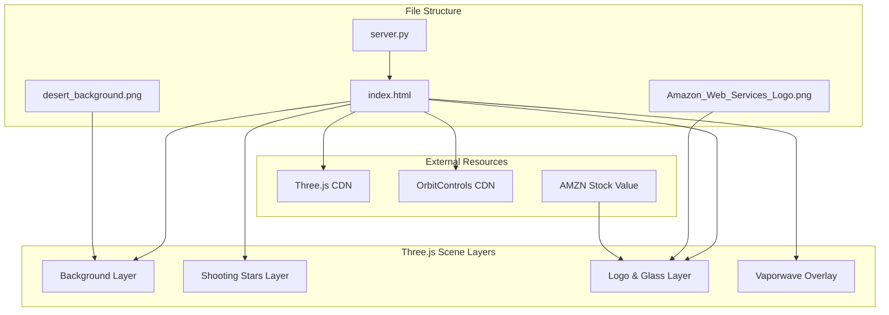

# WebGL AWS Logo Rotating Display - Design Plan

## Overview
A single-page WebGL application displaying a rotating AWS logo on a glossy glass pane with animated background effects, shooting stars, and vaporwave elements.

## Architecture Diagram



## Subtasks Design

### Subtask 1: Data Gathering & Image Generation
**Concerns**: External data acquisition and asset preparation

#### 1.1 AMZN Stock Price
- Use Perplexity MCP Server to fetch current AMZN stock price
- Store as hardcoded value in the HTML/JS

#### 1.2 Desert Background Generation
- Use AWS Nova Canvas MCP Server
- Specifications:
  - Size: 1920x1088 pixels
  - Content: Desert at night with clear starry sky
  - Fantastical colorful supernatural vegetation (no cacti)
  - Color palette: Deep blues for sky, warm earth tones for desert, vibrant colors for vegetation

### Subtask 2: Core WebGL Scene Structure
**Concerns**: Basic Three.js setup and scene organization

#### 2.1 Scene Initialization
```javascript
// Scene structure (embedded in index.html)
const scene = new THREE.Scene();
const camera = new THREE.PerspectiveCamera(75, window.innerWidth/window.innerHeight, 0.1, 1000);
const renderer = new THREE.WebGLRenderer({ antialias: true, alpha: true });
```

#### 2.2 Layer Management
- **Layer 0**: Fixed background image (CSS background)
- **Layer 1**: Shooting stars (independent scene/camera)
- **Layer 2**: Logo and glass pane (main scene with OrbitControls)
- **Layer 3**: Vaporwave overlay (2D canvas overlay or post-processing)

### Subtask 3: Glass Pane & Logo System
**Concerns**: Interactive 3D elements with mouse control

#### 3.1 Glass Pane Design
```javascript
// Glass material properties
const glassMaterial = new THREE.MeshPhysicalMaterial({
    transparent: true,
    opacity: 0.3,
    roughness: 0.05,
    metalness: 0.1,
    reflectivity: 0.9,
    clearcoat: 1.0,
    clearcoatRoughness: 0.0
});
```

#### 3.2 Logo Integration
- Load AWS PNG as texture
- Apply to plane geometry
- Position in front of glass pane
- Add slow auto-rotation: `rotation.y += 0.001`

#### 3.3 Stock Price Display
- Create 3D text geometry below logo
- Format: "$XXX.XX"
- Rotate with logo as child object

#### 3.4 Mouse Controls
- Implement OrbitControls
- Limit rotation angles for better UX
- Enable damping for smooth interaction

### Subtask 4: Shooting Stars Animation
**Concerns**: Independent animated background effects

#### 4.1 Star Particle System
```javascript
// Shooting star trajectory calculation
class ShootingStar {
    constructor() {
        this.position = new THREE.Vector3(
            Math.random() * skyWidth - skyWidth/2,  // Random X within sky
            skyTop,                                   // Start above horizon
            -50                                       // Behind camera plane
        );
        this.velocity = new THREE.Vector3(
            (Math.random() - 0.5) * 0.5,  // Slight X variation
            -2 - Math.random() * 3,        // Downward speed
            5 + Math.random() * 5          // Toward camera
        );
        this.opacity = 0.0;  // Start invisible
        this.trail = [];     // Trail positions
    }
    
    update() {
        // Update position
        this.position.add(this.velocity);
        
        // Update opacity based on Z distance
        this.opacity = Math.min(1.0, (this.position.z + 50) / 100);
        
        // Reset if past camera
        if (this.position.z > 10) {
            this.reset();
        }
    }
}
```

#### 4.2 Sky Polygon Detection
- Analyze background image to identify sky region
- Define boundaries for star spawn area
- Ensure stars only appear in sky portion

### Subtask 5: Vaporwave Effects
**Concerns**: Aesthetic 2D overlay animations

#### 5.1 Vertical Line Generation
```javascript
class VaporwaveLine {
    constructor() {
        this.x = Math.random() * window.innerWidth;
        this.width = 2 + Math.random() * 8;
        this.baseY = window.innerHeight * 0.7;  // Near ground level
        this.height = 100 + Math.random() * 200;
        this.targetOpacity = 0.3 + Math.random() * 0.4;
        this.currentOpacity = 0;
        this.color = this.getRandomVaporColor();
        this.speed = 0.5 + Math.random() * 2;
    }
    
    getRandomVaporColor() {
        const colors = [
            'rgba(255, 0, 255, ',   // Magenta
            'rgba(0, 255, 255, ',   // Cyan
            'rgba(255, 0, 128, ',   // Pink
            'rgba(128, 0, 255, '    // Purple
        ];
        return colors[Math.floor(Math.random() * colors.length)];
    }
    
    render(ctx) {
        const gradient = ctx.createLinearGradient(
            this.x, this.baseY,
            this.x, this.baseY - this.height
        );
        gradient.addColorStop(0, this.color + '0)');  // Fully transparent
        gradient.addColorStop(1, this.color + this.currentOpacity + ')');
        
        ctx.strokeStyle = gradient;
        ctx.lineWidth = this.width;
        ctx.beginPath();
        ctx.moveTo(this.x, this.baseY);
        ctx.lineTo(this.x, this.baseY - this.height);
        ctx.stroke();
    }
}
```

### Subtask 6: Integration & Optimization
**Concerns**: Combining all systems efficiently

#### 6.1 Render Loop Structure
```javascript
function animate() {
    requestAnimationFrame(animate);
    
    // Update logo rotation
    logoGroup.rotation.y += 0.001;
    
    // Update shooting stars
    shootingStars.forEach(star => star.update());
    
    // Update vaporwave lines
    vaporwaveLines.forEach(line => line.update());
    
    // Render main scene (logo/glass)
    renderer.render(scene, camera);
    
    // Render overlay effects
    renderVaporwaveOverlay();
}
```

#### 6.2 Performance Considerations
- Use object pooling for shooting stars
- Limit maximum active vaporwave lines
- Implement LOD for complex geometries
- Use efficient material settings

## File Structure (Minimal)

```
webgl/
├── index.html                      # Single HTML file with embedded JS/CSS
├── server.py                       # Python HTTP server
├── Amazon_Web_Services_Logo.png   # Existing AWS logo
└── desert_background.png          # Generated background image
```

## Implementation Sequence

1. **Phase 1: Setup & Assets**
   - Fetch AMZN stock price
   - Generate desert background
   - Create server.py

2. **Phase 2: Core Structure**
   - Create index.html with Three.js setup
   - Implement basic scene and camera
   - Add background image

3. **Phase 3: Logo System**
   - Implement glass pane
   - Add AWS logo texture
   - Add stock price text
   - Implement OrbitControls

4. **Phase 4: Effects**
   - Add shooting stars system
   - Implement vaporwave overlay
   - Fine-tune animations

5. **Phase 5: Testing**
   - Launch Python server
   - Test in Chrome browser
   - Use DevTools for debugging
   - Optimize performance

## Technical Specifications

### Dependencies (CDN)
```html
<!-- Three.js -->
<script src="https://cdnjs.cloudflare.com/ajax/libs/three.js/r128/three.min.js"></script>
<!-- OrbitControls -->
<script src="https://cdn.jsdelivr.net/npm/three@0.128.0/examples/js/controls/OrbitControls.js"></script>
```

### Browser Requirements
- Chrome latest version
- WebGL 2.0 support
- JavaScript ES6+

### Server Configuration
```python
# server.py
import http.server
import socketserver

PORT = 8054
Handler = http.server.SimpleHTTPRequestHandler

with socketserver.TCPServer(("", PORT), Handler, bind_and_activate=False) as httpd:
    httpd.allow_reuse_address = True
    httpd.server_bind()
    httpd.server_activate()
    print(f"Server running at http://localhost:{PORT}/")
    httpd.serve_forever()
```

## Key Design Decisions

1. **Single HTML File**: All JavaScript and CSS embedded to minimize files
2. **Layer Separation**: Independent rendering for non-interactive elements
3. **2D Overlay for Vaporwave**: Simpler than 3D volumetric effects
4. **Object Pooling**: Reuse shooting star objects for performance
5. **CDN Dependencies**: No local Three.js files needed

## Success Criteria

- [ ] AWS logo rotates slowly on glossy glass pane
- [ ] OrbitControls allow mouse interaction with logo only
- [ ] Background image fits page automatically
- [ ] 3-5 shooting stars continuously animated
- [ ] Stars flow from horizon toward camera
- [ ] Vaporwave lines appear from ground level
- [ ] AMZN stock price displays under logo
- [ ] Runs smoothly in Chrome browser
- [ ] Python server serves on port 8054

## Notes

- Keep implementations simple (KISS principle)
- Use Context7 for Three.js best practices
- Test frequently with browser DevTools
- Focus on visual impact with minimal complexity