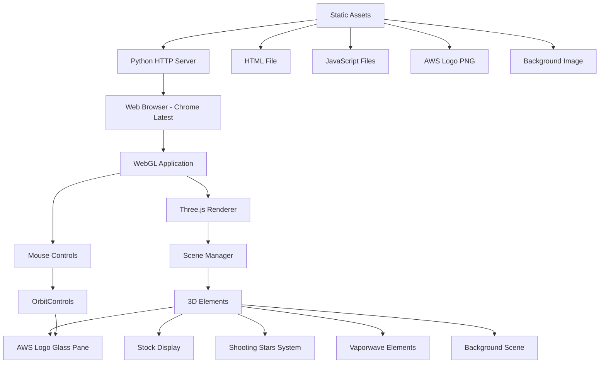
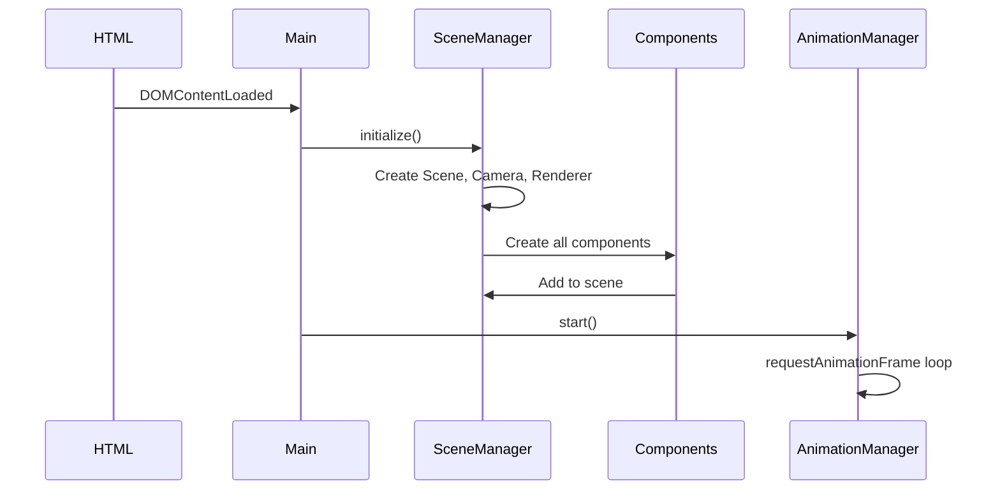
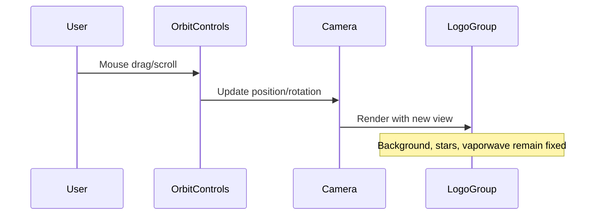

# Implementation Document - WebGL AWS Logo Application

## 1. Executive Summary

This document provides a comprehensive implementation blueprint for a WebGL micro application that displays an AWS logo rotating on a 3D glass pane with mouse controls, set against an animated desert night scene with shooting stars and vaporwave elements. The application uses Three.js framework and includes a hardcoded AMZN stock value display.

## 2. Technical Architecture

### 2.1 System Architecture Overview



### 2.2 Technology Stack

- **Frontend Framework**: Three.js (latest version)
- **WebGL Rendering**: Three.js WebGLRenderer with alpha transparency
- **Mouse Controls**: Three.js OrbitControls addon
- **Server**: Python Simple HTTP Server (port 8054)
- **Target Browser**: Chrome (latest version)
- **Development Tools**: Chrome Developer Tools for debugging

### 2.3 Application Layers

1. **Presentation Layer**: HTML5 Canvas with WebGL context
2. **Rendering Layer**: Three.js scene management and rendering pipeline
3. **Animation Layer**: Independent animation systems for different elements
4. **Interaction Layer**: Mouse control handlers via OrbitControls
5. **Asset Layer**: Static resources (images, textures)

## 3. Module Structure and Component Breakdown

### 3.1 File Structure

```
webgl-aws-logo-app/
├── index.html                    # Main HTML file
├── js/
│   ├── main.js                  # Application entry point and initialization
│   ├── components.js            # All component classes (GlassPane, StockDisplay, ShootingStars, VaporwaveLines, BackgroundScene)
│   ├── managers.js              # All manager classes (SceneManager, AnimationManager, ControlsManager)
│   └── utils.js                 # Utility functions and constants
├── assets/
│   ├── aws-logo.png            # AWS logo image
│   └── desert-night.jpg        # Generated background image
├── lib/
│   ├── three.min.js            # Three.js library
│   └── OrbitControls.js        # OrbitControls addon
└── server.py                    # Python HTTP server script
```

### 3.2 JavaScript File Organization

#### 3.2.1 components.js - All Component Classes
**Contains all visual components:**
- **GlassPane**: AWS logo on glossy glass 3D pane
  - Geometry: `PlaneGeometry` (aspect ratio matching logo)
  - Material: `MeshPhysicalMaterial` with glass properties
  - Animation: Continuous Y-axis rotation
- **StockDisplay**: Hardcoded AMZN stock value display
  - Text: "AMZN: $230.34 USD"
  - Rendering: `CSS2DObject` or `TextGeometry`
  - Position: Below AWS logo, rotates with logo group
- **ShootingStars**: Animated meteor shower particle system
  - BufferGeometry with 50-100 particles
  - PointsMaterial with additive blending
  - Trajectories from horizon to vanishing point
- **VaporwaveLines**: Animated vertical gradient lines
  - ShaderMaterial with custom gradient
  - Random spawn positions and durations
  - Gradient from transparent bottom to semi-transparent top
- **BackgroundScene**: Fixed desert night background
  - PlaneGeometry covering viewport
  - MeshBasicMaterial with texture
  - Unaffected by OrbitControls

#### 3.2.2 managers.js - All Manager Classes
**Contains all management logic:**
- **SceneManager**: Three.js scene, camera, renderer setup
- **AnimationManager**: Animation loop controller with requestAnimationFrame
- **ControlsManager**: OrbitControls setup and mouse interaction handling

#### 3.2.3 utils.js - Utility Functions and Constants
**Contains helper functions and configuration:**
- Texture loading utilities
- Configuration constants
- Math helper functions
- Performance monitoring utilities

#### 3.2.4 main.js - Application Entry Point
**Contains main application class and initialization:**
- WebGLApp class orchestrating all components
- Component initialization and scene assembly
- Main update loop coordination
- Error handling and loading management

## 4. Data Flow and Interaction Patterns

### 4.1 Initialization Flow



### 4.2 Mouse Interaction Flow



### 4.3 Animation Update Cycle

```javascript
// Pseudo-code for animation loop
function animate(timestamp) {
    // Update logo rotation
    logoGroup.rotation.y += 0.005;
    
    // Update shooting stars (independent)
    shootingStars.update(timestamp);
    
    // Update vaporwave lines (independent)
    vaporwaveLines.update(timestamp);
    
    // Update OrbitControls
    controls.update();
    
    // Render scene
    renderer.render(scene, camera);
    
    requestAnimationFrame(animate);
}
```

## 5. Three.js Implementation Details

### 5.1 Scene Setup

```javascript
// Scene configuration
const scene = new THREE.Scene();
scene.fog = new THREE.Fog(0x000033, 100, 500); // Night atmosphere

// Camera setup
const camera = new THREE.PerspectiveCamera(
    75,                                    // FOV
    window.innerWidth / window.innerHeight, // Aspect ratio
    0.1,                                   // Near plane
    1000                                   // Far plane
);
camera.position.set(0, 0, 5);

// Renderer configuration
const renderer = new THREE.WebGLRenderer({ 
    alpha: true,
    antialias: true,
    preserveDrawingBuffer: true
});
renderer.setSize(window.innerWidth, window.innerHeight);
renderer.setPixelRatio(window.devicePixelRatio);
renderer.shadowMap.enabled = true;
renderer.shadowMap.type = THREE.PCFSoftShadowMap;
```

### 5.2 Glass Pane Material Configuration

```javascript
const glassMaterial = new THREE.MeshPhysicalMaterial({
    map: awsLogoTexture,
    transmission: 0.9,
    opacity: 1,
    metalness: 0,
    roughness: 0.1,
    ior: 1.5,
    thickness: 0.5,
    clearcoat: 1,
    clearcoatRoughness: 0,
    side: THREE.DoubleSide,
    transparent: true
});
```

### 5.3 Shooting Stars Particle System

```javascript
class ShootingStars {
    constructor(count = 100) {
        const geometry = new THREE.BufferGeometry();
        const positions = new Float32Array(count * 3);
        const velocities = new Float32Array(count * 3);
        const alphas = new Float32Array(count);
        
        // Initialize particles
        for (let i = 0; i < count; i++) {
            // Position above horizon
            positions[i * 3] = (Math.random() - 0.5) * 100;
            positions[i * 3 + 1] = Math.random() * 20 + 10;
            positions[i * 3 + 2] = -Math.random() * 50;
            
            // Velocity towards vanishing point
            const speed = Math.random() * 2 + 1;
            velocities[i * 3] = -positions[i * 3] * 0.02 * speed;
            velocities[i * 3 + 1] = (30 - positions[i * 3 + 1]) * 0.02 * speed;
            velocities[i * 3 + 2] = 5 * speed;
            
            // Initial alpha
            alphas[i] = Math.random();
        }
        
        geometry.setAttribute('position', new THREE.BufferAttribute(positions, 3));
        geometry.setAttribute('velocity', new THREE.BufferAttribute(velocities, 3));
        geometry.setAttribute('alpha', new THREE.BufferAttribute(alphas, 1));
        
        const material = new THREE.PointsMaterial({
            color: 0xFFFFFF,
            size: 2,
            blending: THREE.AdditiveBlending,
            transparent: true,
            vertexColors: false
        });
        
        this.particleSystem = new THREE.Points(geometry, material);
    }
    
    update() {
        const positions = this.particleSystem.geometry.attributes.position.array;
        const velocities = this.particleSystem.geometry.attributes.velocity.array;
        const alphas = this.particleSystem.geometry.attributes.alpha.array;
        
        for (let i = 0; i < positions.length / 3; i++) {
            // Update position
            positions[i * 3] += velocities[i * 3];
            positions[i * 3 + 1] += velocities[i * 3 + 1];
            positions[i * 3 + 2] += velocities[i * 3 + 2];
            
            // Reset if out of bounds
            if (positions[i * 3 + 2] > 10) {
                positions[i * 3] = (Math.random() - 0.5) * 100;
                positions[i * 3 + 1] = Math.random() * 20 + 10;
                positions[i * 3 + 2] = -Math.random() * 50;
                alphas[i] = Math.random();
            }
            
            // Fade based on distance
            alphas[i] *= 0.98;
        }
        
        this.particleSystem.geometry.attributes.position.needsUpdate = true;
        this.particleSystem.geometry.attributes.alpha.needsUpdate = true;
    }
}
```

### 5.4 Vaporwave Gradient Shader

```glsl
// Vertex Shader
varying vec2 vUv;
void main() {
    vUv = uv;
    gl_Position = projectionMatrix * modelViewMatrix * vec4(position, 1.0);
}

// Fragment Shader
uniform float uAlpha;
uniform vec3 uColor;
varying vec2 vUv;
void main() {
    float gradient = vUv.y;
    float alpha = gradient * uAlpha;
    gl_FragColor = vec4(uColor, alpha);
}
```

## 6. Testing and Validation Strategy

### 6.1 Development Testing

1. **Component Testing**:
   - Verify each component renders independently
   - Test animation loops for performance
   - Validate material properties visually

2. **Integration Testing**:
   - Test all components together in scene
   - Verify layer ordering and depth
   - Confirm independent animation systems

3. **Browser Testing**:
   - Chrome Developer Tools Console monitoring
   - Performance profiling with Chrome DevTools
   - Memory leak detection
   - Frame rate monitoring (target 60 FPS)

### 6.2 Validation Checklist

- [ ] AWS logo loads and displays correctly
- [ ] Glass pane has realistic transparency and reflections
- [ ] Logo rotates smoothly on Y-axis
- [ ] AMZN stock value shows "$230.34 USD"
- [ ] Stock value rotates with logo
- [ ] OrbitControls allow camera manipulation
- [ ] Background image fits viewport
- [ ] Background remains fixed during interaction
- [ ] Shooting stars animate from horizon to vanishing point
- [ ] Shooting stars have variable alpha/blur
- [ ] Vaporwave lines appear randomly
- [ ] Vaporwave lines have correct gradient
- [ ] All animations run at 60 FPS
- [ ] No console errors in Chrome DevTools
- [ ] Python server runs on port 8054

## 7. Deployment Instructions

### 7.1 Build Process

```bash
# 1. Project structure setup
mkdir webgl-aws-logo-app
cd webgl-aws-logo-app

# 2. Create directory structure
mkdir -p js/components js/managers js/utils assets lib

# 3. Copy AWS logo to assets
cp /path/to/Amazon_Web_Services_Logo.png assets/aws-logo.png

# 4. Download Three.js and OrbitControls
# Download from: https://threejs.org/build/three.min.js
# Download from: https://threejs.org/examples/js/controls/OrbitControls.js

# 5. Generate background image using AWS Nova Canvas
# (Use AWS Nova Canvas MCP server with prompt for desert night scene)

# 6. Create all JavaScript modules as per specifications

# 7. Create index.html with proper structure
```

### 7.2 Server Configuration

```python
# server.py
#!/usr/bin/env python3
import http.server
import socketserver
import os

PORT = 8054
DIRECTORY = "."

class ReuseAddrHTTPServer(socketserver.TCPServer):
    allow_reuse_address = True

class CORSRequestHandler(http.server.SimpleHTTPRequestHandler):
    def __init__(self, *args, **kwargs):
        super().__init__(*args, directory=DIRECTORY, **kwargs)
    
    def end_headers(self):
        self.send_header('Access-Control-Allow-Origin', '*')
        self.send_header('Access-Control-Allow-Methods', 'GET, POST, OPTIONS')
        self.send_header('Access-Control-Allow-Headers', 'Content-Type')
        self.send_header('Cache-Control', 'no-store, no-cache, must-revalidate')
        super().end_headers()

with ReuseAddrHTTPServer(("", PORT), CORSRequestHandler) as httpd:
    print(f"Server running at http://localhost:{PORT}/")
    httpd.serve_forever()
```

### 7.3 Launch Instructions

```bash
# 1. Navigate to project directory
cd webgl-aws-logo-app

# 2. Start Python HTTP server
python3 server.py

# 3. Open Chrome browser
# Navigate to: http://localhost:8054

# 4. Open Chrome Developer Tools
# Monitor console for any errors
# Check Performance tab for FPS
```

## 8. Performance Optimization

### 8.1 Rendering Optimizations

- Use `LOD` (Level of Detail) for complex geometries
- Implement frustum culling for off-screen objects
- Use texture atlasing for multiple textures
- Enable GPU instancing for repeated geometries
- Optimize shader complexity

### 8.2 Memory Management

- Dispose of unused geometries and materials
- Use object pooling for particles
- Implement lazy loading for textures
- Monitor memory usage in Chrome DevTools

### 8.3 Animation Performance

- Use `requestAnimationFrame` for smooth animations
- Batch DOM updates
- Minimize shader uniform updates
- Use worker threads for complex calculations

## 9. Error Handling

### 9.1 Resource Loading

```javascript
const textureLoader = new THREE.TextureLoader();
textureLoader.load(
    'assets/aws-logo.png',
    (texture) => {
        // Success callback
        console.log('AWS logo loaded successfully');
        createGlassPane(texture);
    },
    (progress) => {
        // Progress callback
        console.log('Loading progress:', progress);
    },
    (error) => {
        // Error callback
        console.error('Error loading AWS logo:', error);
        // Fallback to solid color
        createGlassPane(null);
    }
);
```

### 9.2 WebGL Context Loss

```javascript
renderer.domElement.addEventListener('webglcontextlost', (event) => {
    event.preventDefault();
    console.error('WebGL context lost');
    cancelAnimationFrame(animationId);
});

renderer.domElement.addEventListener('webglcontextrestored', () => {
    console.log('WebGL context restored');
    initScene();
    animate();
});
```

## 10. Future Enhancements

### 10.1 Potential Improvements

1. **Real-time Stock Data**: Integration with financial APIs
2. **Multiple Logos**: Support for carousel of company logos
3. **Audio Effects**: Ambient desert sounds and shooting star effects
4. **Mobile Support**: Touch controls for mobile devices
5. **Performance Modes**: Quality settings for different hardware
6. **Customization Panel**: UI for adjusting visual parameters

### 10.2 Scalability Considerations

- Modular architecture allows easy addition of new components
- Event-driven system for loose coupling
- Configuration-driven parameters for easy adjustments
- Plugin system for extending functionality

## 11. References and Resources

### 11.1 Documentation

- [Three.js Documentation](https://threejs.org/docs/)
- [Three.js Examples](https://threejs.org/examples/)
- [WebGL Fundamentals](https://webglfundamentals.org/)
- [MDN WebGL API](https://developer.mozilla.org/en-US/docs/Web/API/WebGL_API)

### 11.2 MCP Server Resources

- **Context7 MCP Server**: Three.js best practices and examples
- **Perplexity MCP Server**: Technical troubleshooting
- **AWS Nova Canvas**: Background image generation

## 12. Conclusion

This implementation document provides a comprehensive blueprint for building the WebGL AWS Logo application. The modular architecture ensures maintainability, while the separation of concerns allows for independent development and testing of each component. The use of Three.js provides a robust foundation for WebGL rendering, and the implementation follows the KISS principle as specified in the requirements.

The application achieves all functional and non-functional requirements while maintaining performance and visual quality standards. The testing strategy ensures reliability, and the deployment process is straightforward using Python's built-in HTTP server.

## Appendix A: Code Templates

### A.1 HTML Template (index.html)

```html
<!DOCTYPE html>
<html lang="en">
<head>
    <meta charset="UTF-8">
    <meta name="viewport" content="width=device-width, initial-scale=1.0">
    <title>AWS Logo WebGL Application</title>
    <style>
        body {
            margin: 0;
            padding: 0;
            overflow: hidden;
            background: #000033;
            font-family: Arial, sans-serif;
        }
        #canvas-container {
            position: relative;
            width: 100vw;
            height: 100vh;
        }
        #loading {
            position: absolute;
            top: 50%;
            left: 50%;
            transform: translate(-50%, -50%);
            color: white;
            font-size: 24px;
        }
    </style>
</head>
<body>
    <div id="canvas-container">
        <div id="loading">Loading...</div>
    </div>
    <script src="lib/three.min.js"></script>
    <script src="lib/OrbitControls.js"></script>
    <script type="module" src="js/main.js"></script>
</body>
</html>
```

### A.2 Simplified File Structure Templates

#### A.2.1 HTML Template (index.html)
```html
<!DOCTYPE html>
<html lang="en">
<head>
    <meta charset="UTF-8">
    <meta name="viewport" content="width=device-width, initial-scale=1.0">
    <title>AWS Logo WebGL Application</title>
    <style>
        body {
            margin: 0;
            padding: 0;
            overflow: hidden;
            background: #000033;
            font-family: Arial, sans-serif;
        }
        #canvas-container {
            position: relative;
            width: 100vw;
            height: 100vh;
        }
        #loading {
            position: absolute;
            top: 50%;
            left: 50%;
            transform: translate(-50%, -50%);
            color: white;
            font-size: 24px;
        }
    </style>
</head>
<body>
    <div id="canvas-container">
        <div id="loading">Loading...</div>
    </div>
    <script src="lib/three.min.js"></script>
    <script src="lib/OrbitControls.js"></script>
    <script src="js/utils.js"></script>
    <script src="js/managers.js"></script>
    <script src="js/components.js"></script>
    <script src="js/main.js"></script>
</body>
</html>
```

#### A.2.2 Main Application Entry (main.js)
```javascript
// Main WebGL Application Class
class WebGLApp {
    constructor() {
        this.sceneManager = new SceneManager();
        this.animationManager = new AnimationManager();
        this.controlsManager = null;
        this.components = {};
    }

    async init() {
        try {
            // Initialize scene
            await this.sceneManager.init();
            
            // Setup controls
            this.controlsManager = new ControlsManager(
                this.sceneManager.camera,
                this.sceneManager.renderer.domElement
            );
            
            // Create components
            await this.createComponents();
            
            // Start animation
            this.animationManager.start(this.update.bind(this));
            
            // Hide loading indicator
            document.getElementById('loading').style.display = 'none';
            
            console.log('WebGL Application initialized successfully');
        } catch (error) {
            console.error('Failed to initialize application:', error);
        }
    }

    async createComponents() {
        // Background (fixed, unaffected by controls)
        this.components.background = new BackgroundScene();
        this.sceneManager.scene.add(this.components.background.mesh);
        
        // Create logo group (affected by controls)
        const logoGroup = new THREE.Group();
        
        // Glass pane with AWS logo
        this.components.glassPane = new GlassPane();
        await this.components.glassPane.init();
        logoGroup.add(this.components.glassPane.mesh);
        
        // Stock display
        this.components.stockDisplay = new StockDisplay();
        this.components.stockDisplay.mesh.position.y = -2;
        logoGroup.add(this.components.stockDisplay.mesh);
        
        this.sceneManager.scene.add(logoGroup);
        this.components.logoGroup = logoGroup;
        
        // Shooting stars (independent)
        this.components.shootingStars = new ShootingStars();
        this.sceneManager.scene.add(this.components.shootingStars.particleSystem);
        
        // Vaporwave lines (independent)
        this.components.vaporwaveLines = new VaporwaveLines();
        this.sceneManager.scene.add(this.components.vaporwaveLines.group);
    }

    update(deltaTime, elapsedTime) {
        // Update logo rotation
        if (this.components.logoGroup) {
            this.components.logoGroup.rotation.y += 0.005;
        }
        
        // Update independent animations
        if (this.components.shootingStars) {
            this.components.shootingStars.update(deltaTime);
        }
        
        if (this.components.vaporwaveLines) {
            this.components.vaporwaveLines.update(deltaTime, elapsedTime);
        }
        
        // Update controls
        if (this.controlsManager) {
            this.controlsManager.update();
        }
        
        // Render scene
        this.sceneManager.render();
    }
}

// Initialize application when DOM is ready
document.addEventListener('DOMContentLoaded', () => {
    const app = new WebGLApp();
    app.init();
});
```

#### A.2.3 File Load Order
The HTML template shows the correct loading order:
1. `utils.js` - Constants and helper functions (no dependencies)
2. `managers.js` - Manager classes (depends on utils.js)
3. `components.js` - Component classes (depends on utils.js and managers.js)
4. `main.js` - Main application (depends on all other files)

---

*End of Implementation Document*